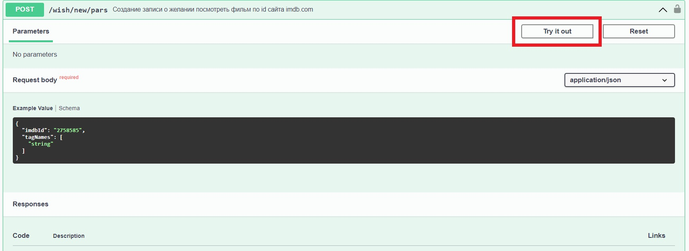
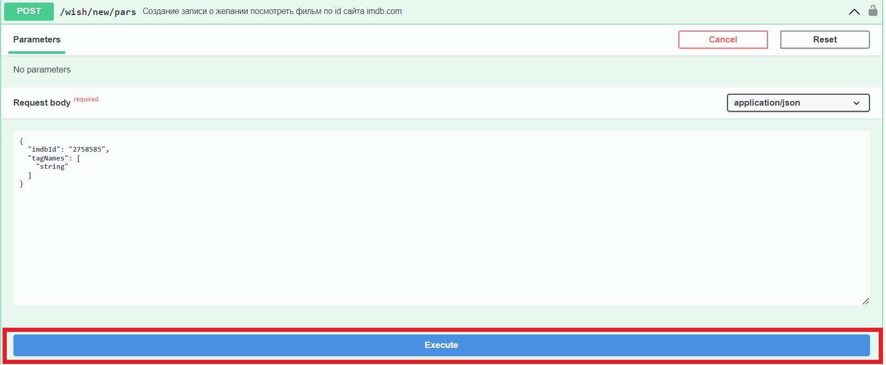
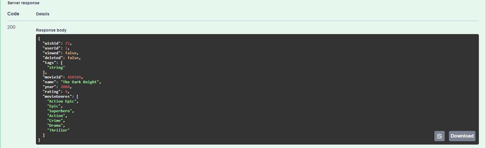
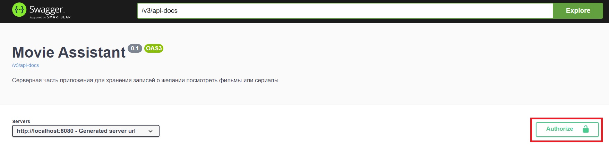
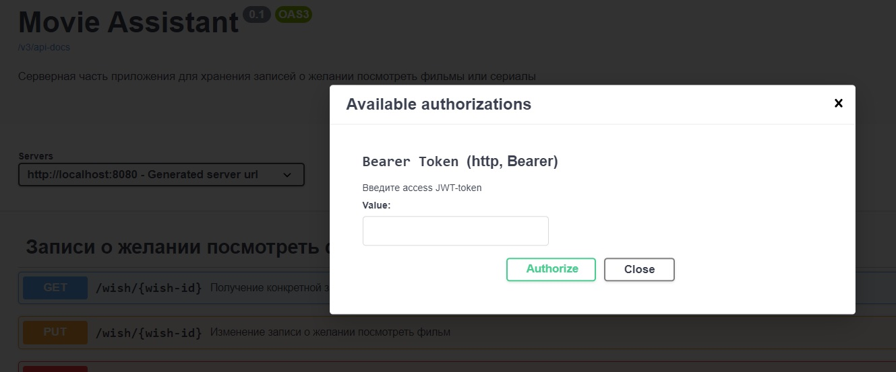
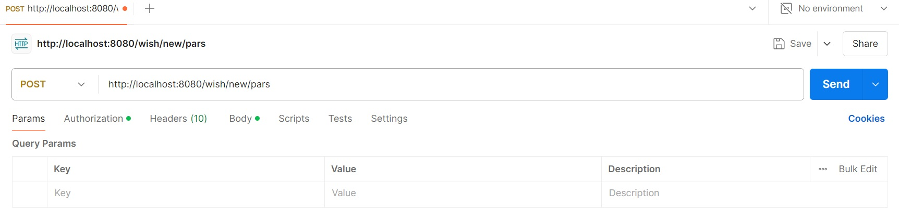
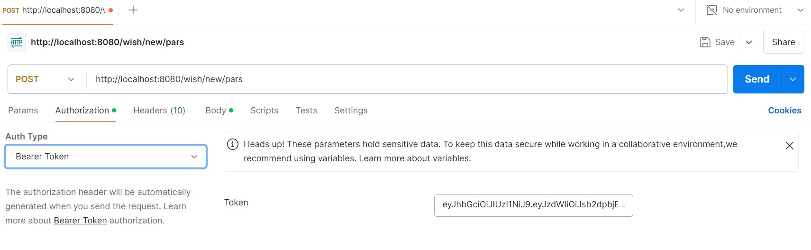
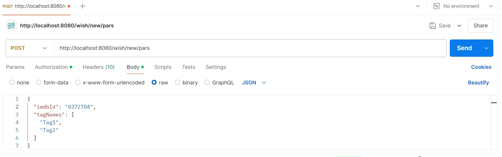
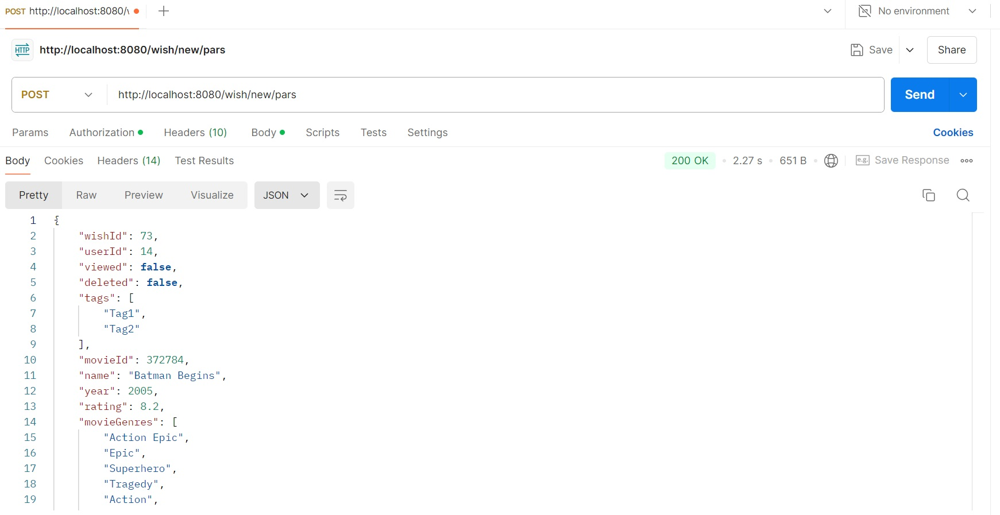

# Movie Assistant

Приложение для хранения информации об интересных фильмах и предоставления
случайного варианта, когда выбор картины на вечер зашел в тупик.

## Описание проекта
Movie Assistant — это серверное приложение, реализующее REST API для
взаимодействия с реляционной базой данных, 
которая управляет коллекцией фильмов, запланированных к просмотру.

Приложение является частью разрабатываемого микросервисного приложения ([подробнее](#next)). 
В текущей версии программы [реализован функционал](#kafka) для связи микросервисов через брокер сообщений Apache Kafka.

### Функции приложения
1. Сохранение записей о фильмах:
- Пользователь может добавлять фильмы в свой список, указывая ID картины с сайта imdb.com.
- К записи можно добавить персональные теги, облегчающие поиск и фильтрацию.
    - Теги могут включать информацию о настроении, сюжете, лицах, участвующих в создании фильма.
    - Примеры тегов: "А24", "Если будет грустно", "Действие в уютной английской деревушке".
- Дополнительные данные о фильме (год выпуска, жанры, рейтинг) загружаются с сайта imdb.com при добавлении записи.

2. Получение случайного фильма:
- Приложение предоставляет случайную рекомендацию из коллекции пользователя.
- Пользователь может конкретизировать выбор, указав желаемый год выпуска, рейтинг, жанры или теги.

3. Управление записями:
- Пользователь может редактировать теги, отмечать просмотренные фильмы
и удалять записи.

4. Добавление пользователей в друзья.
- Пользователь может направлять и рассматривать заявки на добавление в друзья 
для поиска общих фильмов и обмена интересами с другими пользователями.

5. Просмотр коллекций.
- Пользователю доступна возможность просмотра всех записей в собственном списке, а также списках друзей.
- Результаты запроса списков также можно фильтровать и сортировать по дополнительным параметрам.
- Приложение предоставляет топ фильмов, составленный на основе коллекций пользователей.

6. Получение фильма для совместного просмотра.
- Пользователь может указать круг друзей и получить случайную картину 
или весь список общих фильмов, которые интересуют всю компанию.

## Установка 
- Movie Assistant — это серверное приложение, предназначенное для развертывания на сервисах облачных инфраструктур, 
таких как AWS, Google Cloud Platform или Azure.
- После развертывания на выбранной платформе, программа будет доступна для использования клиентским приложением по URL-адресу, 
установленному в соответствии с правилами сервиса.
- Для удобства развертывания приложения на облачных сервисах Docker-образ с актуальной версией программы доступен
[на сайте Docker Hub](https://hub.docker.com/r/bolshakovmi/movie_assistant)
- Кроме того, проект включает в себя файлы конфигурации для контейнеризации, такие как [Dockerfile](Dockerfile) и [docker-compose.yml](docker-compose.yml). 
В случае внесения изменений в проект вы можете легко создать новый образ.
- Для развертывания на конкретной облачной платформе воспользуйтесь инструментами и инструкциями соответствующего сервиса.
- Для тестирования и отладки приложение также может быть запущено на локальной машине.
- В случае возникновения сложностей с развертыванием приложения на конкретном устройстве воспользуйтесь одним из способов, указанных ниже.

### Использование Docker Compose
1. Установите Docker ([ссылка на официальную инструкцию](https://docs.docker.com/get-started/)).
2. Скачайте актуальный файл ```docker-compose.yml``` [из репозитория проекта в GitHub.](https://github.com/bolshakovMI/movieAssistant/blob/master/docker-compose.yml)
3. Запустите командную строку в директории, в которой вы сохранили файл ```docker-compose.yml```.
4. Выполните команду 
```bash
docker compose up
```

- Данный способ запустит на вашей машине контейнеры с базой данных и самим приложением.
- По умолчанию к приложению можно обращаться по порту 8080.
- Для изменения порта приложения укажите желаемый порт в свойстве ```services.app.ports``` скаченного файла ```docker-compose.yml```: 
```yml
services:
  app:
    ports: "8081:8080"
```    

### Установка без Docker
1. Установите и запустите базу данных PostgreSQL ([ссылка на официальную инструкцию](https://www.postgresql.org/download/)).
2. Скопируйте репозиторий командой 
```bash
git clone https://github.com/bolshakovMI/movieAssistant.git
```
3. В случае необходимости измените настройки доступа к базе данных в файле
```src/main/resources/application.yml```.
```yml
spring:
  datasource:
    url: jdbc:postgresql://localhost:5432/movie_helper  # вместо 5432 укажите порт на котором запущена БД на вашем компьютере
                                                        # вместо movie_helper укажите имя вашей БД
    username: movie_helper_admin                        # вместо movie_helper_admin укажите имя пользователя БД
    password: movie_helper_password                     # вместо movie_helper_password укажите пароль этого пользователя
```
4. Выполните в директории проекта команду 
```bash
mvn clean install.
```
а затем
```bash
mvn spring-boot:run.
```
- Данный способ требует наличия на вашем компьютере JRE версии 18 и выше, а также Maven 3.8.6 и выше. В случае их отсутствия выполните следующие инструкции:
  * [Установка JRE](https://www.java.com/ru/download/help/download_options_ru.html).
  * [Установка Maven](https://maven.apache.org/install.html).
- Для изменения порта приложения (по умолчанию 8080) явно укажите свойство ```server.port``` в файле ```src/main/resources/application.yml```.


## Зависимости приложения
- Язык программирования: Java 17.
- Фреймворк: Spring Boot 3.3.2.
- Сборщик проекта: Maven (предоставляется фреймворком).
- Сервер приложений: Apache Tomcat 10.1.26 (предоставляется фреймворком).
- СУБД: PostgreSQL 13.
- С полным списком библиотек, используемых в проекте можно ознакомиться 
в конфигурационном файле [pom.xml.](pom.xml)

## Использование
- Приложение реализует набор конечных точек, предоставляющих доступ к ресурсам приложения.
- Ниже указаны все актуальные конечные точки с краткой характеристикой и необходимыми атрибутами запроса. 
- Подробнее о назначении и структуре конкретного тела или параметра запроса вы можете прочитать при нажатии на интересующий элемент.
- При направлении запроса используйте URL конечной точки, указанный в таблице, с добавлением перед ним адреса приложения.
  * Если вы запустили приложение на вашем устройстве используйте синтаксис ```http://localhost:``` + ```номер порта``` + ```URL конечной точки```, например:
```
http://localhost:8080/wish/new/pars
```
  * Если вы используете облачные сервисы, замените ```http://localhost:8080``` на адрес предоставленный службой. 

### Использование браузера и Swagger API
- Приложение дополнительно поддерживает конечные точки Swagger API 
(```/swagger-ui/index.html``` и ```/v3/api-docs```). 
- При обращении по URL ```/swagger-ui/index.html```, вы можете получить перечень всех конечных точек приложения, 
сведения необходимые для запроса, а также возможные ответы.
- Для того, чтобы направить запрос на определенную конечную точку, нажмите на кнопку ```try it out```.
----
  
----
- Укажите параметры и тело запроса, а также переменные пути, после чего нажмите на кнопку ```Execute```.
----
  
----
- Ниже будет выведен результат выполнения запроса:
----
  
----
- Токен для авторизации можно указать, нажав на кнопку Authorize.
----
  
----
  
----
### Использование Postman
- Другим способом тестирования приложения может быть сервис отправки HTTP-запросов, например Postman ([ссылка на скачивание](https://www.postman.com/downloads/)).
- После запуска приложения укажите метод и адрес запроса.
- Во вкладке ```Params``` внесите переменные пути.
----
  
----
- Для конечных точек, требующих авторизации нажмите на ```Authorization```, выберите ```Auth Type``` ```Bearer Token``` и внесите учетные данные.
----
  
----
- Если требуется указать тело запроса, нажмите на кнопку ```Body``` и выберите тип, как указано на изображении ниже:
----
  
----
- После нажатия на ```Send``` запрос будет направлен и отобразится HTTP-ответ.
----
  
----

## Конечные точки приложения:
### Регистрация, полномочия, данные пользователей

| Метод | URL                           | Параметры запроса                                                   | Переменные пути                                                                        | Тело запроса                              | Описание                                       | Режим доступа                      |
|-------|-------------------------------|---------------------------------------------------------------------|----------------------------------------------------------------------------------------|-------------------------------------------|------------------------------------------------|------------------------------------|
| POST  | /users/new                    |                                                                     |                                                                                        | [UserRequest](#signup)                    | Регистрация нового пользователя                | Неаутентифицированный пользователь |
| GET   | /users/all                    | [page](#page), [perPage](#per_page), [sort](#sort), [order](#order) |                                                                                        |                                           | Получение учетных данных обо всех аккаунтах    | ROLE_ADMIN                         |
| GET   | /users/{user}                 |                                                                     | user - логин пользователя                                                              |                                           | Получение учетных данных одного аккаунта       | ROLE_ADMIN, создатель записи       |
| PUT   | /users/password               |                                                                     |                                                                                        | [PasswordChangeRequest](#password_change) | Изменение пароля пользователя                  | Создатель записи                   |
| PUT   | /users/authority/set          |                                                                     |                                                                                        | [AuthorityRequest](#authority)            | Изменение полномочий пользователя              | ROLE_ADMIN                         |
| PUT   | /users/authority/add          |                                                                     |                                                                                        | [AuthorityRequest](#authority)            | Добавление полномочий пользователя             | ROLE_ADMIN                         |
| PUT   | /users/authority/delete       |                                                                     |                                                                                        | [AuthorityRequest](#authority)            | Отзыв полномочий пользователя                  | ROLE_ADMIN                         |
| PUT   | /users/{username}/{is-enable} |                                                                     | username - логин пользователя, <br/>is-enable желаемое состояние аккаунта (true/false) |                                           | Блокировка/разблокировка пользователя          | ROLE_ADMIN                         |
| GET   | /users-info/all               | [page](#page), [perPage](#per_page), [sort](#sort), [order](#order) |                                                                                        |                                           | Получение информации обо всех пользователях    | Аутентифицированный пользователь   |
| GET   | /users-info/{id}              |                                                                     | id - номер записи в таблице user_info                                                  |                                           | Получение информации о конкретном пользователе | Аутентифицированный пользователь   |
| PUT   | /users-info/{id}              |                                                                     | id - номер записи в таблице user_info                                                  | [UserInfoRequest](#user_info)             | Редактирование информации о пользователе       | ROLE_ADMIN, создатель записи       |

### Авторизация

| Метод | URL           | Параметры запроса | Переменные пути | Тело запроса           | Описание                       | Режим доступа                      |
|-------|---------------|-------------------|-----------------|------------------------|--------------------------------|------------------------------------|
| POST  | /auth/login   |                   |                 | [LoginRequest](#login) | Вход пользователя в систему    | Неаутентифицированный пользователь |
| POST  | /auth/refresh |                   |                 |                        | Получение нового access токена | Неаутентифицированный пользователь |


### Социальные функции

| Метод | URL                                            | Параметры запроса                                                                                                                                             | Переменные пути                                                                 | Тело запроса | Описание                                                                   | Режим доступа                                     |
|-------|------------------------------------------------|---------------------------------------------------------------------------------------------------------------------------------------------------------------|---------------------------------------------------------------------------------|--------------|----------------------------------------------------------------------------|---------------------------------------------------|
| POST  | /friendships/requests/{user-id}                |                                                                                                                                                               | user-id - пользователь, которому отправлена заявка                              |              | Направление заявки на добавление в друзья указанному пользователю          | Аутентифицированный пользователь                  |
| PUT   | /friendships/requests/consider/{friendship-id} | [RequestConfirmationStatus](#request_confirmation)                                                                                                            | friendship-id - id заявки                                                       |              | Рассмотрение заявки в друзья по ее id                                      | Аутентифицированный пользователь (адресат заявки) |
| PUT   | /friendships/status/{user-id}                  | [RequestStatus](#status)                                                                                                                                      | user-id - id пользователя, с которым меняется статус                            |              | Изменение статуса отношений между текущим пользователем и указанным        | Аутентифицированный пользователь                  |
| GET   | /friendships/friends/{user-id}                 | [page](#page), [perPage](#per_page), [sort](#sort), [order](#order)                                                                                           | user-id - id пользователя                                                       |              | Получение информации о друзьях указанного пользователя                     | ROLE_ADMIN                                        |
| GET   | /friendships/friends                           | [page](#page), [perPage](#per_page), [sort](#sort), [order](#order)                                                                                           |                                                                                 |              | Получение информации о друзьях текущего пользователя                       | Аутентифицированный пользователь                  |
| GET   | /friendships/requests/outgoing/{user-id}       | [page](#page), [perPage](#per_page), [sort](#sort), [order](#order), [WithdrawnStatus](#withdrawn_status), [RequestConfirmationStatus](#request_confirmation) | user-id - id пользователя                                                       |              | Получение информации об исходящих заявках указанного пользователя          | ROLE_ADMIN                                        |
| GET   | /friendships/requests/outgoing                 | [page](#page), [perPage](#per_page), [sort](#sort), [order](#order), [WithdrawnStatus](#withdrawn_status), [RequestConfirmationStatus](#request_confirmation) |                                                                                 |              | Получение информации об исходящих заявках текущего пользователя            | Аутентифицированный пользователь                  |
| GET   | /friendships/requests/incoming/{user-id}       | [page](#page), [perPage](#per_page), [sort](#sort), [order](#order), [WithdrawnStatus](#withdrawn_status), [RequestConfirmationStatus](#request_confirmation) | user-id - id пользователя                                                       |              | Получение информации о входящих заявках указанного пользователя            | ROLE_ADMIN                                        |
| GET   | /friendships/requests/incoming                 | [page](#page), [perPage](#per_page), [sort](#sort), [order](#order), [WithdrawnStatus](#withdrawn_status), [RequestConfirmationStatus](#request_confirmation) |                                                                                 |              | Получение информации о входящих заявках текущего пользователя              | Аутентифицированный пользователь                  |
| GET   | /friendships/status/{user1-id}/{user2-id}      |                                                                                                                                                               | user1-id, user2-id - id двух пользователей, отношения для которых запрашиваются |              | Получение информации о статусе отношений текущего пользователя с указанным | ROLE_ADMIN                                        |
| GET   | /friendships/status/{user-id}                  |                                                                                                                                                               | user-id - id пользователя, для которому запрашивается статус отношений          |              | Получение информации о статусе отношений между указанными пользователями   | Аутентифицированный пользователь                  |
| GET   | /friendships/all                               | [page](#page), [perPage](#per_page), [sort](#sort), [order](#order), [WithdrawnStatus](#withdrawn_status), [RequestConfirmationStatus](#request_confirmation) |                                                                                 |              | Получение списка всех отношений пользователей в приложении                 | ROLE_ADMIN                                        |

- В контексте этой таблицы текущим пользователем считается пользователь с учетными данными которого авторизовался отправитель запроса.
- Указанный пользователь - это пользователь с id, содержащимся в запросе.

### Управление записями

| Метод  | URL             | Параметры запроса | Переменные пути           | Тело запроса                              | Описание                                                        | Режим доступа                    |
|--------|-----------------|-------------------|---------------------------|-------------------------------------------|-----------------------------------------------------------------|----------------------------------|
| POST   | /wish/new/pars  |                   |                           | [WishParseRequest](#wish_parse_request)   | Создание записи о желании посмотреть фильм по id сайта imdb.com | Аутентифицированный пользователь |
| PUT    | /wish/{wish-id} |                   | wish-id - id пользователя | [WishUpdateRequest](#wish_update_request) | Изменение записи о желании посмотреть фильм                     | Создатель записи, ROLE_ADMIN     |
| DELETE | /wish/{wish-id} |                   | wish-id - id пользователя |                                           | Удаление записи о желании посмотреть фильм                      | Создатель записи, ROLE_ADMIN     |


### Получение фильмов 
| Метод | URL                   | Параметры запроса                                                   | Переменные пути | Тело запроса                            | Описание                                                                     | Режим доступа                    |
|-------|-----------------------|---------------------------------------------------------------------|-----------------|-----------------------------------------|------------------------------------------------------------------------------|----------------------------------|
| GET   | /wish/users/any       |                                                                     |                 |                                         | Получение случайного фильма из списка желаний                                | Аутентифицированный пользователь |
| GET   | /wish/users/any/param |                                                                     |                 | [WishParamRequest](#wish_param_request) | Получение случайного фильма из списка желаний с учетом переданных параметров | Аутентифицированный пользователь |
| GET   | /wish/users/all       | [page](#page), [perPage](#per_page), [sort](#sort), [order](#order) |                 |                                         | Получение страницы фильмов из списка желаний                                 | Аутентифицированный пользователь |
| GET   | /wish/users/all/param | [page](#page), [perPage](#per_page)                                 |                 | [WishParamRequest](#wish_param_request) | Получение страницы фильмов из списка желаний с учетом переданных параметров  | Аутентифицированный пользователь |

### Получение фильмов общих для нескольких пользователей

| Метод | URL                    | Параметры запроса                   | Переменные пути | Тело запроса                                                    | Описание                                                                                        | Режим доступа                    |
|-------|------------------------|-------------------------------------|-----------------|-----------------------------------------------------------------|-------------------------------------------------------------------------------------------------|----------------------------------|
| GET   | /wish/shared/any       |                                     |                 | [WishWithFriendsRequest](#wish_with_friends_request)            | Получение случайного фильма, общего для нескольких пользователей                                | Аутентифицированный пользователь |
| GET   | /wish/shared/any/param |                                     |                 | [WishParamWithFriendsRequest](#wish_param_with_friends_request) | Получение случайного фильма, общего для нескольких пользователей с учетом переданных параметров | Аутентифицированный пользователь |
| GET   | /wish/shared/all       | [page](#page), [perPage](#per_page) |                 | [WishWithFriendsRequest](#wish_with_friends_request)            | Получение списка фильмов, общих для нескольких пользователей                                    | Аутентифицированный пользователь |
| GET   | /wish/shared/all/param | [page](#page), [perPage](#per_page) |                 | [WishParamWithFriendsRequest](#wish_param_with_friends_request) | Получение списка фильмов, общих для нескольких пользователей с учетом переданных параметров     | Аутентифицированный пользователь |


### Остальные read-операции

| Метод | URL             | Параметры запроса                                                   | Переменные пути     | Тело запроса | Описание                                               | Режим доступа                       |
|-------|-----------------|---------------------------------------------------------------------|---------------------|--------------|--------------------------------------------------------|-------------------------------------|
| GET   | /wish/{wish-id} |                                                                     | wish-id - id записи |              | Получение конкретной записи по id                      | Друзья создателя записи, ROLE_ADMIN |
| GET   | /wish/all       | [page](#page), [perPage](#per_page), [sort](#sort), [order](#order) |                     |              | Получение общего списка записей                        | ROLE_ADMIN                          |
| GET   | /wish/top       | [page](#page), [perPage](#per_page)                                 |                     |              | Получение списка самых популярных фильмов в приложении | Аутентифицированный пользователь    |


### Параметры запроса

#### <a id="per_page"> Integer perPage </a>
+ Количество записей на странице.
+ При пагинации результатов запроса клиент получит только указанное количество записей.
#### <a id="page"> Integer page </a>
+ Номер страницы.
+ Указатель для пагинации.
#### <a id="sort"> String sort </a>
+ Параметр сортировки записей.
#### <a id="order"> Integer order </a>
+ Направление сортировки.
+ Допустимые варианты: ```ASC``` и ```DESC```.
#### <a id="request_confirmation"> RequestConfirmationStatus status </a>
+ Результат рассмотрения входящей заявки в друзья.
+ Допустимые варианты: ```UNCONSIDERED```, ```REJECTED``` и ```ACCEPTED```.
#### <a id="status"> boolean status </a>
+ Изменение статуса отношений, которое требуется пользователю.
+ Допустимые варианты: ```true``` и ```false```.
+ Если используется отправителем заявки, то ```false``` – это отзыв заявки, а ```true``` – подтверждение направления заявки.
+ Если используется адресатом заявки, то ```false``` – отклонение заявки, а ```true``` – принятие заявки.
#### <a id="withdrawn_status"> boolean withdrawn </a>
+ Изменение статуса заявки на добавление в друзья, которое требуется отправителю.
+ Допустимые варианты: ```true``` и ```false```.
+ ```False``` – это отзыв заявки, а ```true``` – подтверждение заявки.

### Шаблоны для тел запроса

#### <a id="signup"> [UserRequest](src/main/java/com/example/movieAssistant/model/dto/request/UserRequest.java) </a>
```json
{
  "email": "user1@mail.ru",
  "firstName": "User",
  "lastName": "Userov",
  "birthDay": "01.01.2001",
  "username": "login1",
  "password": "Password1"
}
```
- Поле ```email``` должно соответствовать паттерну ```prefix@postfix.domain_name```.
- Поля ```firstName``` и ```lastName``` должны состоять только из букв.
- Поле ```birthDay``` должно соответствовать паттерну ```dd.MM.yyyy```.
- Поле ```username``` должно быть уникальным в рамках приложения и больше 3 символов. 
- Поле ```password``` должен содержать, как минимум, 1 заглавную букву, 1 строчную букву и 1 цифру.

#### <a id="password_change"> [PasswordChangeRequest](src/main/java/com/example/movieAssistant/model/dto/request/PasswordChangeRequest.java) </a>
```json
{
    "username": "login1",
    "oldPassword": "Password1",
    "newPassword": "Password2"
}
```
- Поле ```username``` указывает на логин пользователя, у которого изменяется пароль.
- Поля ```oldPassword``` и ```newPassword``` должны содержать, как минимум, 1 заглавную букву, 1 строчную букву и 1 цифру.

#### <a id="authority"> [AuthorityRequest](src/main/java/com/example/movieAssistant/model/dto/request/AuthorityRequest.java) </a>
```json
{
  "username": "login1",
  "authorities": [
    "ROLE_ADMIN",
    "ROLE_USER"
  ]
}
```
- Поле ```username``` указывает на логин пользователя, у которого изменяется набор ролей.
- В настоящий момент в приложении доступны два варианта ролей: ```ROLE_ADMIN``` и ```ROLE_USER```.

#### <a id="user_info"> [UserInfoRequest](src/main/java/com/example/movieAssistant/model/dto/request/UserInfoRequest.java) </a>
```json
{
  "email": "user1@mail.ru",
  "firstName": "User",
  "lastName": "Userov",
  "birthDay": "01.01.1994"
}
```
- Поле ```email``` должно соответствовать паттерну ```prefix@postfix.domain_name```.
- Поля ```firstName``` и ```lastName``` должны состоять только из букв.
- Поле ```birthDay``` должно соответствовать паттерну ```dd.MM.yyyy```.

#### <a id="login"> [LoginRequest](src/main/java/com/example/movieAssistant/model/dto/request/LoginRequest.java) </a>
```json
{
  "username": "login1",
  "password": "Password1"
}
```

#### <a id="wish_parse_request"> [WishParseRequest](src/main/java/com/example/movieAssistant/model/dto/request/WishParseRequest.java) </a>
```json
{
  "imdbId": "0455275",
  "tagNames": [
    "Tag1",
    "Tag2"
  ]
}
```
- Поле ```imdbId``` должно содержать id фильма с сайта ```imdb.com``` c обязательным сохранением ведущих нулей.
- Id фильма можно узнать по ссылке на сайте. Все URL страниц фильмов соответствуют паттерну ```https://www.imdb.com/title/tt + id_фильма```. 

#### <a id="wish_update_request"> [WishUpdateRequest](src/main/java/com/example/movieAssistant/model/dto/request/WishUpdateRequest.java) </a>
```json
{
  "viewed": false,
  "shouldTagsBeChanged": false,
  "tagNames": [
    "Tag1",
    "Tag2"
  ]
}
```
- Поле ```viewed``` указывает на статус просмотра фильма.
  * ```true``` - фильм просмотрен.
  * ```false``` - фильм еще не просмотрен.
  * Поле может отсутствовать, если пользователь не планирует менять этот статус.
- Массив ```tagNames``` должен содержать список пользовательских тегов к фильму, которые пользователь хочет установить.
  * Поле может отсутствовать. Последствие отсутствия массива ```tagNames``` зависит от значения ```shouldTagsBeChanged```.
  * Если поле ```shouldTagsBeChanged=true```, то отсутствие ```tagNames``` удаляет все теги пользователя к этому фильму.
  * Если ```shouldTagsBeChanged=false``` - отсутствие ```tagNames``` значит, что пользователь не планирует менять перечень тегов.

#### <a id="wish_with_friends_request"> [WishWithFriendsRequest](src/main/java/com/example/movieAssistant/model/dto/request/WishWithFriendsRequest.java) </a>
```json
{
  "friendsIds": [
    4,
    6
  ]  
}
```
- Массив ```friendsIds``` указывает на пользователей, вместе с которыми текущий пользователь хочет найти общие фильмы.
- В ```friendsIds``` указываются id пользователя в таблице ```user_info```.

#### <a id="wish_param_request"> [WishParamRequest](src/main/java/com/example/movieAssistant/model/dto/request/WishParamRequest.java) </a>
```json
{
  "viewed": false,
  "yearFrom": 2008,
  "yearTo": 2027,
  "ratingFrom": 7.8,
  "ratingTo": 9.4,

  "genreNames": [
    "Genre1",
    "Genre2"
  ],

  "tagNames": [
    "Tag1",
    "Tag2"
  ]
}
```
- Поле ```viewed``` указывает на статус просмотра фильма, который требуется пользователю.
  * По умолчании значение ```false``` (непросмотрен).
- Поля ```yearFrom``` и ```yearTo``` указывают диапазон времени выпуска требуемого фильма.
   * По умолчанию ```yearFrom=1895```, а ```yearTo=2049```.
   * ```YearFrom``` не может быть больше ```2049```, а ```YearTo``` не может быть меньше ```1895```.
- Поля ```ratingFrom``` и ```ratingTo``` устанавливают диапазон рейтинга искомого фильма.
   * По умолчанию ```ratingFrom=1.0```, а ```ratingTo=10.0```.
   * ```RatingFrom``` не может быть больше ```10.0```, а ```ratingTo``` не может быть меньше ```1.0```.
- Массив genreNames может содержать список жанров фильма, которые должны быть у искомого фильма.
  * Жанры фильма определяются в соответствии с сайтом ```imdb.com```.
  * В случае отсутствия поля поиск будет осуществляться вне зависимости от жанров фильма.
- Массив ```tagNames``` может содержать список тегов фильма, которые должны быть у фильма.
  * Учитываются только теги, которые установлены текущим пользователем для конкретного фильма.
  * В случае отсутствия поля поиск будет осуществляться вне зависимости от тегов фильма.

#### <a id="wish_param_with_friends_request"> [WishParamWithFriendsRequest](src/main/java/com/example/movieAssistant/model/dto/request/WishParamWithFriendsRequest.java) </a>
```json
{
  "viewed": false,
  "yearFrom": 2008,
  "yearTo": 2027,
  "ratingFrom": 7.8,
  "ratingTo": 9.4,

  "friendsIds": [
    4,
    6
  ],

  "genreNames": [
    "Genre1",
    "Genre2"
  ]
}
```
- Поле ```viewed``` указывает на статус просмотра фильма, который требуется пользователю.
  * По умолчании значение ```false``` (непросмотрен).
- Поля ```yearFrom``` и ```yearTo``` указывают диапазон времени выпуска требуемого фильма.
  * По умолчанию ```yearFrom=1895```, а ```yearTo=2049```.
  * ```YearFrom``` не может быть больше ```2049```, а ```YearTo``` не может быть меньше ```1895```.
- Поля ```ratingFrom``` и ```ratingTo``` устанавливают диапазон рейтинга искомого фильма.
  * По умолчанию ```ratingFrom=1.0```, а ```ratingTo=10.0```.
  * ```RatingFrom``` не может быть больше ```10.0```, а ```ratingTo``` не может быть меньше ```1.0```.
- Массив ```friendsIds``` указывает на пользователей вместе с которыми текущий пользователь хочет найти общие фильмы.
  * В ```friendsIds``` указываются id пользователя в таблице ```user_info```.
- Массив ```genreNames``` может содержать список жанров фильма, которые должны быть у искомого фильма.
  * Жанры фильма определяются в соответствии с сайтом ```imdb.com```.
  * В случае отсутствия поля поиск будет осуществляться вне зависимости от жанров фильма.


## Особенности системы безопасности приложения
- Система безопасности приложения основана на фреймворке Spring Security.
- Настройка правил доступа к URL приложения осуществляется в методе 
```filterChain(HttpSecurity http)``` класса [SecurityConfig.](src/main/java/com/example/movieAssistant/config/SecurityConfig.java)
- Учетные данные пользователей (логин и пароль) хранятся в таблице ```users``` основной базы данных.
  * По умолчанию пароли пользователей шифруются алгоритмом BCrypt.
  * Альтернативный кодировщик может быть настроен в методе ```passwordEncoder()``` 
  класса [SecurityConfig.](src/main/java/com/example/movieAssistant/config/SecurityConfig.java)
- Полномочия пользователя хранятся в таблице ```authorities``` основной базы данных.

### Аутентификация и авторизация на основе JWT
- Основным способом авторизации и аутентификации является пара JWT.
- При обращении к приложению по URL ```"/auth/login"``` с указанием актуального логина и пароля пользователя 
в теле запроса, клиент получает пару токенов.
  - Access-токен используется клиентом для получения доступа к ресурсам приложения.
    * В HTTP-запросе токен указывается в заголовке ```"Authorization"``` с префиксом ```"Bearer "```.
  - refresh-токен используется для получения новой пары JWT.
    * Для этого клиент должен обратиться по URL ```"/auth/refresh"```
с указанием текущего refresh-токена в заголовке ```"Authorization"``` с префиксом ```"Bearer "```.
    * Для проверки актуальности и возможности отзыва, текущий refresh-токен хранится в таблице ```users``` основной базы данных.
  - Срок истечения access и refresh-токена настраивается свойствами ```jwt.expiration_time.access_token``` 
и ```jwt.expiration_time.refresh_token``` соответственно, при запуске приложения или в конфигурационном файле 
[application.yml.](src/main/resources/application.yml)
    * По умолчанию срок истечения действия access-токена составляет 15 минут, а refresh-токена - 7 дней. 
- Секретный ключ для генерации JWT настраивается свойством ```jwt.signing_key```, при запуске приложения или
в конфигурационном файле [application.yml.](src/main/resources/application.yml)

## <a id="kafka"> Интеграция микросервисов с использованием Apache Kafka </a>

- Приложение содержит необходимые настройки и зависимости для отправки сообщений на сервер брокера Apache Kafka.
- В настоящий момент приложение отправляет брокеру сообщения в случае вызова следующих методов:

| Класс                                                                                         | Метод                                                      | Условие отправки сообщения                      | Топик            | Класс сообщения                       |
|-----------------------------------------------------------------------------------------------|------------------------------------------------------------|-------------------------------------------------|------------------|---------------------------------------|
| [WishParserService](src/main/java/com/example/movieAssistant/services/WishParserService.java) | createWishWithParsing(WishParseRequest request)            | Успешное добавление фильма в коллекцию          | "wish_create"    | [WishCreateEvent](#wish_create_event) |
| [WishService](src/main/java/com/example/movieAssistant/services/WishService.java)             | updateWish(WishUpdateRequest request, Long wishId)         | Внесение информации о просмотре фильма          | "wish_update"    | [WishCreateEvent](#wish_create_event) |
| [FriendService](src/main/java/com/example/movieAssistant/services/FriendService.java)         | considerRequest(Long id, RequestConfirmationStatus status) | Принятие входящей заявки на добавление в друзья | "new_friendship" | [FriendshipEvent](#friendship_event)  |

#### <a id="wish_create_event"> [WishCreateEvent](src/main/java/com/example/movieAssistant/model/dto/event/WishCreateEvent.java) </a>
Класс содержит следующие сведения:
```
- id и название, добавленного фильма,
- id и логин пользователя, который добавил фильм,
- список логинов друзей данного пользователя.
```      

#### <a id="friendship_event"> [FriendshipEvent](src/main/java/com/example/movieAssistant/model/dto/event/FriendshipEvent.java) </a>
Класс содержит следующие сведения:
```
- id, логин и список друзей пользователя, направившего заявку,
- id, логин и список друзей адресата заявки,
- статус заявки (отозвана/актуальна) и ее рассмотрения (принята/отклонена/оставлена без рассмотрения).
```
- Во избежание изменения кода предыдущей версии приложения, добавление функции отправки сообщений реализовано с использованием АОП.
Класс [KafkaProducerAspect](src/main/java/com/example/movieAssistant/kafka/KafkaProducerAspect.java) содержит методы,
которые выполняются после успешного завершения указанных выше методов сервисов.
- Адрес сервера Apache Kafka настраивается свойством ```spring.kafka.bootstrap-servers```, при запуске приложения или
  в конфигурационном файле [application.yml.](src/main/resources/application.yml)
- Создание новых топиков и их настройка осуществляется в классе [KafkaTopicConfig.](src/main/java/com/example/movieAssistant/kafka/KafkaTopicConfig.java)
- Для быстрого запуска приложения и тестирования интеграции с Apache Kafka можно использовать конфигурационный файл [docker-compose-with-kafka.yml,](src/main/resources/docker/docker-compose-with-kafka.yml)
который содержит:
  - docker-образ текущего приложения ([bolshakovmi/movie_assistant](https://hub.docker.com/repository/docker/bolshakovmi/movie_assistant), требуется версия от ```1.1``` и выше),
  - образ тестового приложения-потребителя ([bolshakovmi/consumer:1.0](https://hub.docker.com/repository/docker/bolshakovmi/consumer)), 
который просто выводит в консоль полученные сообщения,
  - образы ```Apache Kafka``` и ```Zookeeper```, совместно выполняющие роль сервера брокера сообщений,
  - образ ```provectuslabs/kafka-ui```, который предоставляет, при обращении к порту ```8090```(по умолчанию), 
интерфейс для получения сведений о текущем состоянии брокера сообщений (топики, потребители, количество отправленных сообщений и т.д.).
    
 
## <a id="next"> Дальнейшие планы по развитию приложения </a>

- Улучшение качества и стабильности:

  - Добавление модульных и интеграционных тестов.
  - Настройка логирования с использованием ```ElasticSearch``` для быстрого и комплексного процесса выявления проблем 
за счет централизованного сбора, хранения и анализа логов.
  - Интеграция ```Kibana``` для визуализации и анализа данных из ```ElasticSearch```.

- Повышение производительности и оптимизация:

  - Настройка кэширования популярных запросов с использованием БД Redis.

- Расширение функциональности:

  - Создание микросервиса, который реализует динамическую ленту новостей,
с использованием ```Server-Sent Events``` и реактивных потоков (```Spring WebFlux```).
В ленте новостей должны динамически отображаться различные события, связанные с друзьями пользователя, например:
    - добавление нового фильма в коллекцию,
    - просмотр фильма,
    - добавление пользователем нового друга.

  - Создание микросервиса для чата пользователей с использованием ```WebSocket```.
Чат позволит организовать обсуждение в реальном времени конкретного фильма пользователями планирующими или уже посмотревшими его. 

- Мониторинг и анализ:

  - Добавление Prometheus для сбора метрик о работе приложения и выявления трендов в его работе.
  - Интеграция Grafana для визуализации данных из Prometheus. 


## Лицензия
Этот проект распространяется под лицензией MIT. Дополнительную информацию можно найти в файле [LICENSE](LICENSE). 

## Вклад

Мы приветствуем любой вклад в развитие проекта!

В частности, мы будем благодарны, если вы:
1. Можете реализовать и интегрировать новые функции для приложения.
2. Нашли ошибку или способ оптимизировать код программы.
3. Готовы предложить альтернативные способы реализации функционала приложения.

Чтобы внести вклад:
1. Создайте fork репозитория.
2. Создайте новую ветку для своих изменений.
3. Внесите изменения и протестируйте их.
4. Создайте pull request.

Адрес электронной почты для связи: ```bolshakov.mi.ig@gmail.com```.